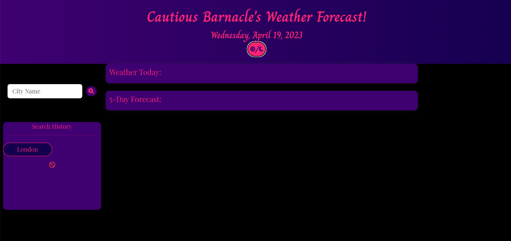
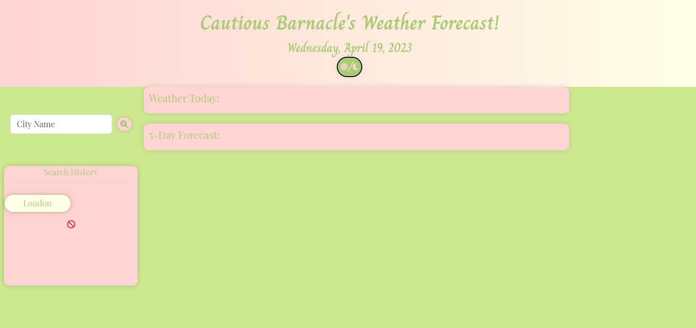

# Cautious Barnacle Web App

## Description
Application to check weather in multiple locations, while retaining previously search cities in Search History. Weather shows today's weather and 5 day forecast. Clicking Sun/Moon icons will change light and dark css style sheets for different themes

## Acceptance Criteria
GIVEN a weather dashboard with form inputs
WHEN I search for a city
THEN I am presented with current and future conditions for that city and that city is added to the search history
WHEN I view current weather conditions for that city
THEN I am presented with the city name, the date, an icon representation of weather conditions, the temperature, the humidity, and the wind speed
WHEN I view future weather conditions for that city
THEN I am presented with a 5-day forecast that displays the date, an icon representation of weather conditions, the temperature, the wind speed, and the humidity
WHEN I click on a city in the search history
THEN I am again presented with current and future conditions for that city

## Link to Application
https://karaulfger.github.io/cautious-barnacle/

https://github.com/KaraUlfger/cautious-barnacle 

## Screenshots of Application 

## Credits
Karathesymbiote, UW Coding Bootcamp, and all the wonderful help from Bootcamp Staff and Students
